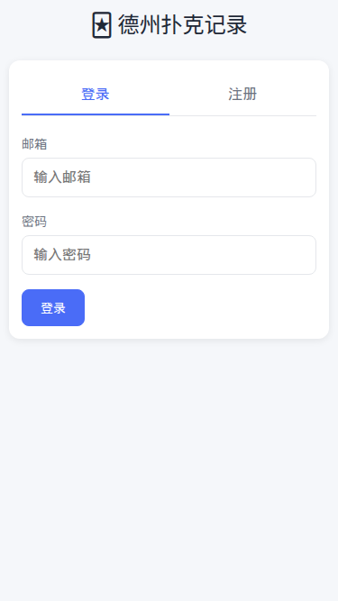
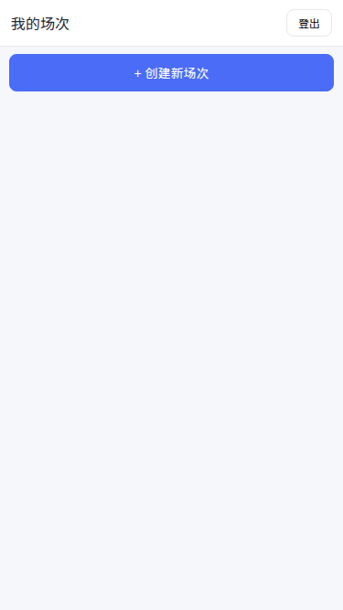
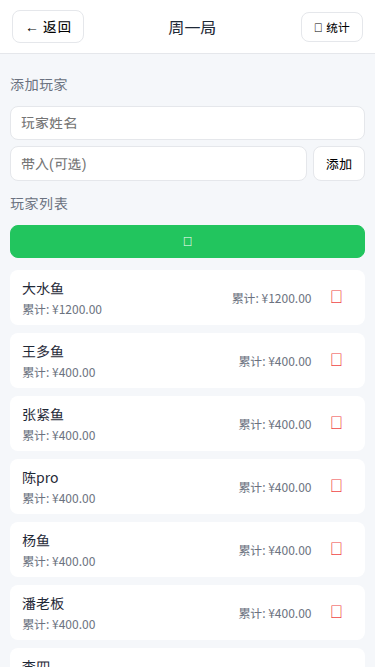
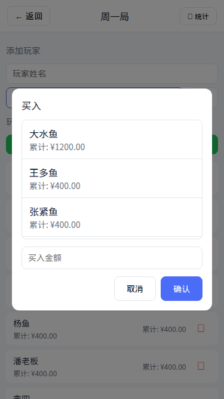
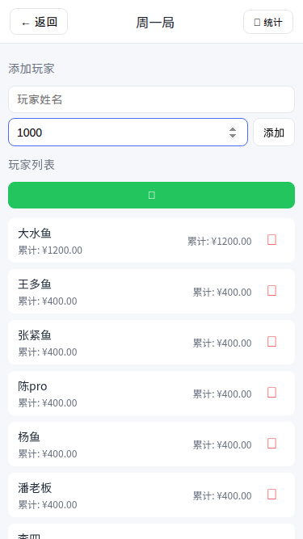
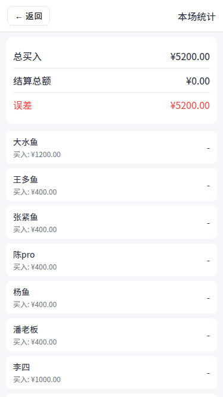

# PokerNote - 德州扑克记录工具

<div align="center">


一个简单好用的德州扑克玩家买入和结算记录工具，支持多人游戏数据管理。

</div>

## 📱 界面预览

> 以下是移动端界面截图（375x667 iPhone SE 尺寸）

| 登录/注册 | 场次列表 |
|:---:|:---:|
|  |  |

| 添加玩家 | 买入操作 |
|:---:|:---:|
|  |  |

| 结算界面 | 统计结果 |
|:---:|:---:|
|  |  |

### 截图目录

```
docs/images/
├── login.png         # 登录/注册页面
├── sessions.png      # 场次列表页面
├── add-player.png    # 添加玩家页面
├── buyin.png         # 买入弹窗页面
├── settle.png        # 玩家结算页面
└── stats.png         # 统计结果页面
```

> **提示**：如需更新截图，请访问 http://localhost:3000 进行操作，然后使用浏览器截取对应页面保存到 `docs/images/` 目录。

## ✨ 功能特性

| 功能 | 说明 |
|------|------|
| 📧 用户认证 | 邮箱注册/登录，数据隔离 |
| 🎰 场次管理 | 创建/删除游戏场次 |
| 👥 玩家管理 | 添加玩家 + 首次带入，支持历史姓名自动补全 |
| 💰 买入记录 | 选择玩家 → 输入金额，自动累计 |
| 🧾 结算方式 | 支持结余金额、水上金额、水下金额三种方式 |
| 📊 实时统计 | 显示每位玩家输赢、计算总误差 |
| 📱 移动端优化 | H5 页面，手机浏览器友好 |

## 🛠 技术栈

- **前端**：原生 HTML5 + CSS3 + JavaScript（无框架依赖）
- **后端**：Node.js + Express 5
- **数据库**：SQLite（better-sqlite3）
- **认证**：bcryptjs + express-session

## 🚀 快速开始

### 环境要求

- Node.js >= 14
- npm >= 6

### 安装

```bash
git clone https://github.com/qdog2009-blip/PokerNote.git
cd PokerNote
npm install
```

### 启动

```bash
npm start
```

服务启动后访问：**http://localhost:3000**

### 后台运行（Linux/macOS）

```bash
# 使用 nohup
nohup npm start > /tmp/PokerNote.log 2>&1 &

# 使用 pm2（推荐）
npm install -g pm2
pm2 start server.js --name PokerNote
```

### 使用 Docker（可选）

```dockerfile
FROM node:20-alpine
WORKDIR /app
COPY package*.json ./
RUN npm ci --production
COPY . .
EXPOSE 3000
CMD ["node", "server.js"]
```

```bash
docker build -t PokerNote .
docker run -p 3000:3000 -v $(pwd)/PokerNote.db:/app/PokerNote.db PokerNote
```

## 📖 使用流程

```
1. 注册账号 → 登录
2. 创建场次（如 "2024年1月周五局"）
3. 添加玩家（输入姓名 + 可选首次带入金额）
4. 买入操作（💰 买入 → 选玩家 → 输入金额）
5. 结算（点击玩家 → 输入结余/水上/水下）
6. 查看统计（📊 统计 → 输赢 + 误差）
```

## 📁 项目结构

```
PokerNote/
├── server.js          # Express 服务入口
├── database.js        # SQLite 数据库初始化
├── package.json       # 项目配置
├── README.md          # 项目文档
├── docs/
│   └── images/        # 截图目录
│       ├── login.png
│       ├── sessions.png
│       ├── add-player.png
│       ├── buyin.png
│       ├── settle.png
│       └── stats.png
├── public/            # 静态资源
│   ├── index.html     # 主页面
│   ├── css/
│   │   └── style.css  # 样式（移动端优化）
│   └── js/
│       └── app.js     # 前端逻辑
└── PokerNote.db         # SQLite 数据库文件（运行后自动生成）
```

## 💾 数据存储

- 所有数据存储在本地 `PokerNote.db` 文件
- 支持数据持久化，重启后数据不丢失
- 数据文件位于项目根目录

## 🤝 贡献

欢迎提交 Issue 或 Pull Request！

## 📄 License

MIT License

---

**作者**：qdog2009-blip  
**GitHub**：https://github.com/qdog2009-blip/PokerNote
